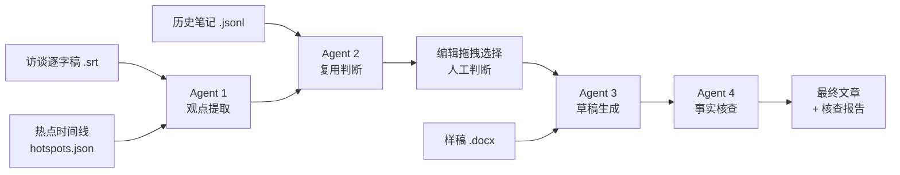
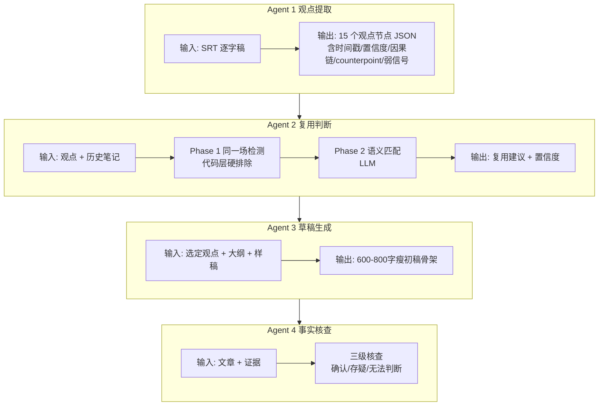
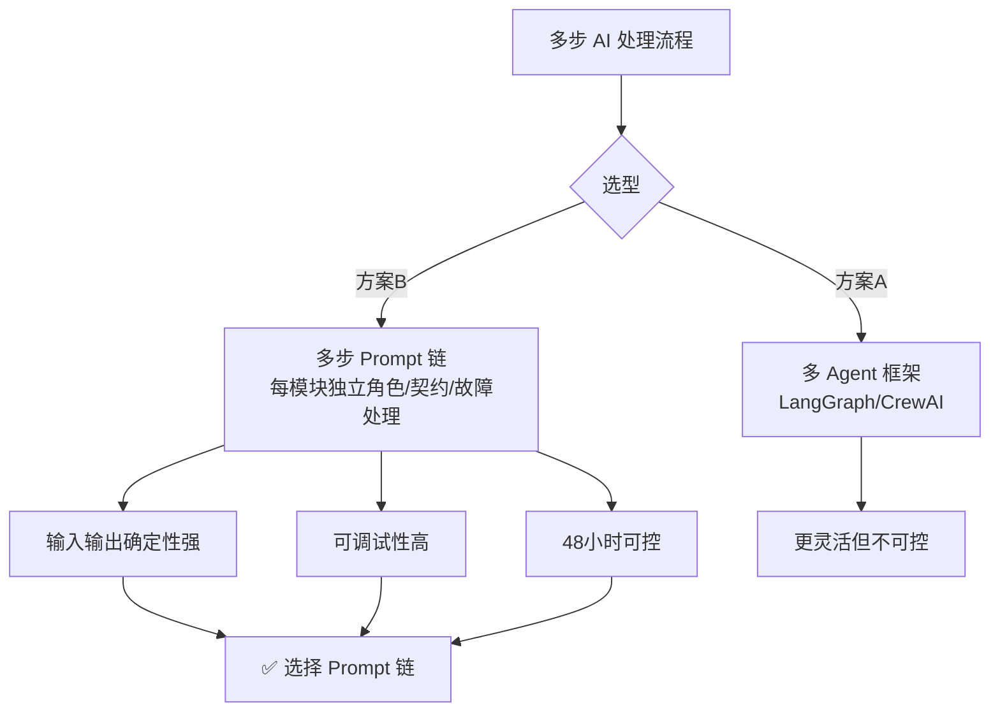

# 架构图 · Notesman Content Map

## 数据流

## 四 Agent 职责与契约

## 技术决策：为什么用 Prompt 链而非 Agent 框架

## 关键架构决策

| 决策 | 原因 | 位置 |
|------|------|------|
| Agent 2 拆两阶段 | 同一场检测和语义匹配是互斥任务，塞一个调用会 hedging | `app/api/reuse/route.ts` |
| 多层 JSON fallback | DeepSeek 输出不标准（时间范围/嵌套引号/截断） | `lib/anthropic.ts` |
| 离线 fallback | API 不可用时不阻塞演示 | `lib/local-generators.ts` |
| 预置演示数据 | 面试官打开即看交互，不需现场配 API | `lib/mock-data.ts` |
