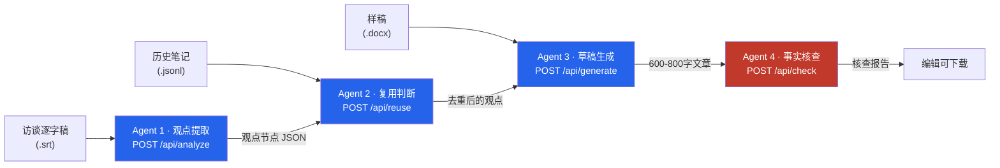

# 笔记侠 AI 增强内容复盘工具 — Notesman Content Map

> 把一段访谈逐字稿，自动变成一篇可发布的商业深度文章 —— 四 Agent 管线 · FDE 加速营 200 人第二名

[](https://nextjs.org)
[](https://react.dev)
[](https://www.typescriptlang.org)
[](https://deepseek.com)

---

## 📌 Problem（背景与问题）

笔记侠是一家把**大咖演讲/访谈整理成商业深度文章**的内容公司。编辑的核心工作流是：

1. 拿到一段访谈逐字稿（`.srt`）
2. 从中提取值得写的观点
3. 判断哪些观点和自己历史发过的内容重复（避免炒冷饭）
4. 组织大纲、写成 600–800 字的文章
5. 逐条核查事实，防止写错数字/引用

这套流程过去靠**资深编辑的脑力 + 经验**，一个新编辑上手要几个月，且容易漏观点、写错事实。**赛题**：用 AI 把这条流水线产品化。

## 🤖 Why Agent（为什么是 Agent，而不是单个 LLM）

这五步**不是一次推理能完成的**——每步的输入、输出、约束都不一样：

- 「提取观点」要**发散**（尽可能多、准地找出值得写的点）
- 「复用判断」要**检索比对**（和历史笔记逐条对照）
- 「草稿生成」要**收敛 + 风格约束**（模仿笔记侠样稿的文风）
- 「事实核查」要**批判**（专挑毛病，反向验证）

让一个 Prompt 同时干这四件事，结果就是「什么都会一点、什么都不精」。所以拆成**四个专职 Agent 串成管线**，每个 Agent 只对一道工序负责，边界清晰、可独立验证。

## 🏗️ Architecture（架构）



| Agent | 路由 | 职责 | 输出 |
|-------|------|------|------|
| Agent 1 观点提取 | `POST /api/analyze` | 逐字稿 → 结构化观点节点 | 四象限 + 卡片库 JSON |
| Agent 2 复用判断 | `POST /api/reuse` | 观点 + 历史笔记 → 是否重复 | 去重标记 |
| Agent 3 草稿生成 | `POST /api/generate` | 选定观点 + 大纲 → 文章 | 600–800 字草稿 |
| Agent 4 事实核查 | `POST /api/check` | 文章 + 观点 → 逐条核查 | 核查报告 + 编辑建议 |

## 🛠️ Skills（核心能力）

- **观点提取**：把散乱的访谈口语，提炼成「观点 + 证据原文 + 置信度」的结构化卡片
- **复用判断**：自动对照历史笔记库，标出「已经写过 / 角度重复」的观点，避免炒冷饭
- **风格约束**：草稿生成吃进笔记侠已发布的 3 篇样稿，模仿其文风
- **事实核查**：逐条检查数字、引用、证据是否可追溯

## 🧰 Tools（技术栈）

- **框架**：Next.js 16 · React 19 · TypeScript · Tailwind v4 · shadcn/ui
- **LLM**：DeepSeek（或 Anthropic 兼容 API）
- **输入格式**：`.srt` 逐字稿 · `.jsonl` 历史笔记 · `.docx` 样稿

## 🧠 Memory（记忆 / 上下文）

Agent 2 的「记忆」是**历史笔记库**（`.jsonl`，每行含标题/日期/主题/正文/适用读者/可引用范围）。它决定了：

- 哪些观点是「新观点」值得写，哪些是「旧观点」要跳过
- 文章引用的证据能否追溯到具体笔记条目

这份历史库不是模型内置知识，而是**外部喂进来的可替换记忆**——换个客户的笔记库，就能复用给另一个内容团队。

## 📊 Eval（评估 / 验证）

事实核查 Agent 内置**四条防幻觉规则**（参考 Edward 的 validator 设计）：

1. **`evidence_id` 不存在 → 拒绝**：引用的证据必须在输入里真实存在
2. **置信度只能下调**：Agent 2/3 只能降低观点置信度，不能凭空拔高
3. **数字引用必须可追溯**：文章里的每个数字都能回查到逐字稿原文
4. **多卡去重保留最强**：同一观点出现多个版本时，只留置信度最高的一张

**验证方式**：预置 13 个观点节点是 Agent 1 对题目逐字稿的**真实输出**（不是手写 mock），面试官可直接用 `samples/viewpoints.json` 复核管线效果。

## 💥 Failure Cases（失败案例 / 边界）

| 失败场景 | 表现 | 防线 |
|---------|------|------|
| 观点引用不存在的证据 | 文章「凭空」出现逐字稿里没有的话 | 规则 1：`evidence_id` 校验直接拒绝 |
| LLM 把模糊观点说成确定结论 | 置信度虚高 | 规则 2：置信度只降不升 |
| 文章写错数字/日期 | 事实错误 | 规则 3：数字回查原文 |
| 同一观点被重复生成 | 卡片库冗余 | 规则 4：去重保留最强 |

## 🎨 Design Decisions（设计决策）

| 决策 | 理由 | 代价 |
|------|------|------|
| 拆成 4 个 Agent 而非 1 个 | 每道工序约束不同，专职更可控、可单测 | 管线更长，接口更多 |
| 外部输入（srt/jsonl/docx）而非硬编码 | 面试现场由面试官提供素材，证明「真能跑」 | 依赖输入格式规范 |
| 浏览器下载输出，不接数据库 | 48h 内最快交付，免部署 | 状态不持久 |
| 预置真实输出做演示数据 | 证明不是 demo 假数据 | 需要维护同步 |

## 🚀 快速开始

```bash
git clone https://github.com/gao666-max/notesman-fde.git
cd notesman-fde
cp .env.example .env.local   # 填入 LLM_API_KEY
pnpm install
pnpm dev                     # http://localhost:3000
```

输入 `.srt` / `.jsonl` / `.docx` → 点「导入 SRT」→ 浏览卡片 → 生成草稿 → 事实核查。

---

*这是我把「模糊需求 → 可演示产品」翻译成现实的项目，也是「四层校验法」在工程里的落地：不是信任 AI 输出，是给 AI 输出套上校验规则。*
